[Parallel]: assets/strategies/parallel.svg
[Sync]: assets/strategies/sync.svg
[Sequential]: assets/strategies/sequential.svg

[Single]: assets/strategies/single.svg
[All]: assets/strategies/all.svg
[Any]: assets/strategies/any.svg

[Same]: assets/strategies/same.svg
[Mult]: assets/strategies/mult.svg
[Min]: assets/strategies/min.svg
[Max]: assets/strategies/max.svg
[Sum]: assets/strategies/sum.svg

# pipe

Power of Go channels with io.Pipe usability.
Build multithread tools easily.

- Thread safe
- `io` and `lo` like syntax (Tee, Reduce, Map, etc) but concurrently

## Pipeline Methods

### Map

![Parallel] ![Sync] ![Sequential] ![Single] ![Same]

Take message and convert it into another type by map function.
If input channel is closed then output channel is closed.
Creates a new channel with the same capacity as input.

### Filter

![Parallel] ![Sync] ![Sequential] ![Single] ![Same]

Take message and forward it if filter function return positive.
If input channel is closed then output channel is closed.
Creates a new channel with the same capacity as input.

### Split

![Sequential] ![Single] ![Same]

Take next message and forward to all output channels.
If input channel is closed then all output channels are closed.
Creates new channels with the same capacity as input.

### Spread

![Sequential] ![Single] ![Same]

Take next message and forward it to next output channel.
If input channel is closed then all output channels are closed.
Randomization algorithm is `Round Robin` or `random`.
Creates new channels with the same capacity as input.

### Join

![Sequential] ![All] ![Sum]

Take next available message from any input and forward it to output.
If all input channels are closed then output channel is closed.
Creates new channel with sum of capacities of input channels.

### Merge

![Parallel] ![Sync] ![Sequential] ![Any] ![Min]

Take next message from all channels (wait for data) and send new message into output.
If one of input channels is closed then output channel is closed.
All other input channels will be read till end in background.
Creates new channel with minimal capacity of input channels.

### Route

![Parallel] ![Sync] ![Sequential] ![Single] ![Same]

Take next message from input and forward it to one of output channels by route function.
If input channel is closed then all output channels are closed.
Creates new channels with the same capacity as input.

### Replicate

![Sequential] ![Single] ![Mult]

Take next message from input and forward copies to output.
If input channel is closed then all output channels are closed.
Creates new channel with the same capacity as input multiplied by N.

### Reduce

![Sequential] ![Single] ![Same]

Take several next messages from input and send new message to output.
If input channel is closed then all output channels are closed.
Creates new channel with the same capacity as input.
