# pipe

Power of Go channels with io.Pipe usability.
Build multithread tools easily.

- Thread safe
- `io` and `lo` like syntax (Tee, Reduce, Map, etc) but concurrently

## Understanding Pipeline Methods

<table>
    <thead>
        <tr>
            <th>
                
Visual

            </th>
            <th>
                
Explanation

            </th>
        </tr>
    </thead>
    <tbody>
        <tr>
            <td >
                
            </td>
            <td>
                <table>
                    <tbody>
                        <tr>
                            <td><b>Name</b></td>
                            <td>Map</td>
                        </tr>
                        <tr>
                            <td><b>Description</b></td>
                            <td>
                                Converts each input message to a different type
                            </td>
                        </tr>
                        <tr>
                            <td><b>Input Channels</b></td>
                            <td>
                                1 channel of type T1
                            </td>
                        </tr>
                        <tr>
                            <td><b>Output Channels</b></td>
                            <td>
                                1 channel of type T2
                            </td>
                        </tr>
                        <tr>
                            <td><b>Capacity Strategy</b></td>
                            <td>
                                Creates a channel with the same capacity as the input
                            </td>
                        </tr>
                        <tr>
                            <td><b>Closing Strategy</b></td>
                            <td>
                                The output channel is closed if the input channel is closed
                            </td>
                        </tr>
                    </tbody>
                </table>
            </td>
        </tr>
        <tr>
            <td >
                
            </td>
            <td>
                <table>
                    <tbody>
                        <tr>
                            <td><b>Name</b></td>
                            <td>Filter</td>
                        </tr>
                        <tr>
                            <td><b>Description</b></td>
                            <td>
                                Forwards messages for which the filtering function returns a true value
                            </td>
                        </tr>
                        <tr>
                            <td><b>Input Channels</b></td>
                            <td>
                                1 channel of type T
                            </td>
                        </tr>
                        <tr>
                            <td><b>Output Channels</b></td>
                            <td>
                                1 channel of type T
                            </td>
                        </tr>
                        <tr>
                            <td><b>Capacity Strategy</b></td>
                            <td>
                                Creates a channel with the same capacity as the input
                            </td>
                        </tr>
                        <tr>
                            <td><b>Closing Strategy</b></td>
                            <td>
                                The output channel is closed if the input channel is closed
                            </td>
                        </tr>
                    </tbody>
                </table>
            </td>
        </tr>
    </tbody>
</table>
